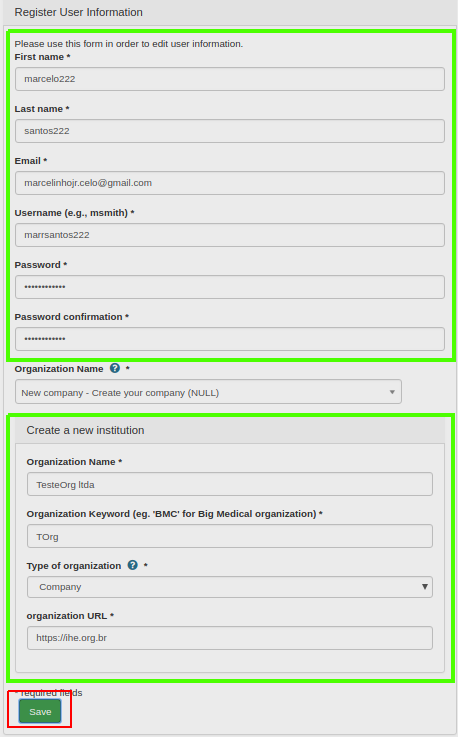
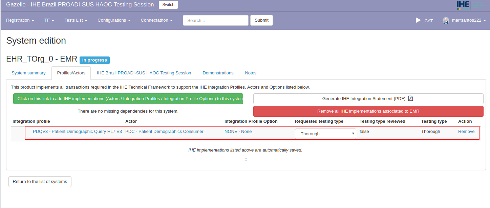

# Instrução para Registro de Sistemas no Gazelle

Esta págna descreve os passos básicos para cadastramento de organização, contatos e registro de sistemas para uma
organização no sistema Gazelle Test Management.

### 1. Criar nova conta de usuário no Gazelle

*Conceitos:*

Um "usuário" representa uma pessoa com login e senha para acessar a ferramenta Gazelle Test Management. Um usuário está sempre vinculado a
uma organização, e somente pode visualizar/alterar informações para essa
organização.

Para criar um novo usuário, acesse a página inicial do Gazelle e clique em "Create an Account".

{width="3.5819444444444444in"
height="2.4138888888888888in"}

Na sequência, preencha os dados para o novo usuário. No campo nome da
organização, selecione uma organização existente ou clique em “New
Company” para criar uma nova organização.

{width="3.365972222222222in"
height="3.0166666666666666in"}

{width="3.1395833333333334in"
height="5.053472222222222in"}

Concluindo o cadastro, o Gazelle enviará uma confirmação para o e-mail
informado.

{width="4.670138888888889in"
height="2.698611111111111in"}

Abra o software de e-mail e clique no link recebido para realizar a
confirmação. Retorne ao sistema Gazelle e faça login com a nova conta de
usuário criada. 

O Gazelle fará login automático para a seção de testes
“Connectathon do IHE USA”. Clique em “Switch”, no canto superior
direito, para selecionar a seção de testes correta.

{width="6.268055555555556in"
height="2.609722222222222in"}

Verifique a lista de seções de testes e selecione a seção “IHE BRAZIL
PROADI-SUS HAOC”.

{width="5.5256944444444445in"
height="2.826388888888889in"}

Após clicar na seção de testes correta, O sistema Gazelle
automaticamente irá logar nesta seção. Observe no canto superior direito
da tela se a seção de testes foi devidamente selecionada e se o logo do
IHE Brasil aparece no canto superior esquerdo.

{width="6.6930555555555555in" height="2.9618055555555554in"}

### 2. Cadastrar Contatos da Organização

*Conceitos:*

Um "Contato" é uma pessoa em sua organização que irá interagir com os organizadores da Maratona de Conectividade durante a preparação e execução de uma sessão de teste. Um "contato" pode ou não, ter uma conta de "usuário" no Gazelle.

Para inserir/atualizar informações de contato no Gazelle utilize o menu Registration -&gt; Manage Contacts.

{width="6.141666666666667in"
height="2.529861111111111in"}

Clique no link "Add a Contact" para inserir o nome, e-mail e telefone para os contatos na sua organização.

{width="5.960416666666666in" height="2.6625in"}

A partir deste momento, digite os detalhes de cada contato e, ao final, clique em “Save”.

Importante lembrar que uma organização deve identificar:

- Contato Financeiro (apenas 1)

- Contato de Marketing (0 ou mais)

- Contato Técnico (1 ou mais)

{width="5.846527777777778in"
height="3.8541666666666665in"}

### 3. Cadastrar Usuários para a Organização

*Conceitos:*

Tipos de papéis de um usuário:

- “Vendor” (usuário padrão): pode gerenciar os testes e configurações
para os sistemas de uma organização.

- “Vendor\_admin” (Administrador): além de testes e configurações, pode gerenciar
usuários relacionados à sua organização (ativar / desativar contas), contatos e participantes para a sessão de teste.

Para cadastrar usuários, acesso o menu Registration -&gt; Manage users.

{width="6.304861111111111in"
height="2.627083333333333in"}

{width="6.302777777777778in"
height="2.979861111111111in"}

E informe os dados para os novos usuários,
clicando em “Save” ao final.

### 4. Cadastrar Sistemas para uma Organização

*Conceitos:*

No Gazelle Test Management, o termo "sistema" refere-se a um conjunto de funcionalidades de aplicações expressas em termos de perfis, atores e opções do IHE. Uma organização pode registrar um ou mais sistemas para uma sessão de teste.

O "sistema" participa da sessão de teste interoperando com "sistemas" pares de outras organizações.

O registro destes sistemas no Gazelle é uma etapa muito importante pois os perfis, atores e opções selecionados orientam muito do que acontece durante uma sessão de teste, por exemplo:

- quais ferramentas de teste serão utilizadas?

- quais testes serão obrigatórios a executar?

- quem serão seus parceiros de teste?

IMPORTANTE: antes de proceder com o cadastro no sistema Gazelle, faça uma leitura minuciosa do Framework Técnico do IHE correspondente aos perfis que serão testados.

Utilize o menu Registration -&gt; Manage Systems para iniciar a função de cadastro de sistemas.

{width="6.6930555555555555in"
height="2.770138888888889in"}

Clique em “Add a System” para adicionar um novo sistema para a organização.

{width="6.6930555555555555in"
height="2.3979166666666667in"}

Observe o campo “System Type” e selecione a opção que melhor categoriza o sistema da organização (os tipos disponíveis as vezes não são muito claros… use
o bom senso para a escolha).

{width="6.6930555555555555in"
height="3.4097222222222223in"}

Depois de inserir as informações requeridas, clique em “Save”.

Na sequência, clique em Profile/Actors.

{width="6.6930555555555555in"
height="3.4590277777777776in"}

Clique no botão verde “Add IHE implementations” para que a tela de seleção de perfis, atores e opções seja iniciada.

{width="6.6930555555555555in"
height="2.5930555555555554in"}

Neste momento, será necessário selecionar todas as combinações de perfis, atores e opções que representam os testes que a organização pretende realizar para o sistema em questão.

{width="6.6930555555555555in"
height="3.3020833333333335in"}

Observe que o campo Integration Profile irá apenas apresentar os perfis disponíveis para teste na Maratona de Conectividade.

A cada seleção de perfil, ator e opção, clique no botão “Add this IHE implementation to this system” para que a combinação perfil/ator/opção selecionada seja incorporado para o sistema.

Repita este procedimento até que todos os perfis/atores e opções estejam devidamente cadastrados para o sistema em questão.

Dependendo do perfil selecionado, pode aparecer um botão laranja “Missing dependencies” mostrando que existe alguma dependência identificada.

{width="6.6930555555555555in"
height="2.8444444444444446in"}

Se este for o caso, pressione este botão para que o sistema Gazelle sugerira os novos perfis/atores que precisam ser considerados para solucionar a dependência.
